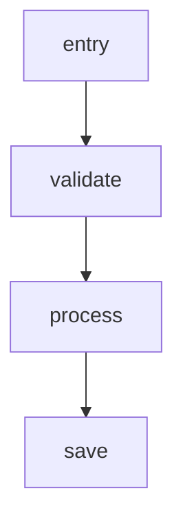

# Code Map Format

Feature-to-implementation traces for codebase navigation.

## Design Principles

### Why Code Maps Exist

1. **Reduce exploration time** - After implementing a feature, I document the code path. Next time I need to modify it, I don't start from scratch.

2. **Session continuity** - Codebase knowledge is lost between sessions. Code maps preserve my understanding.

3. **Quick navigation** - Entry point, call flow, key files at a glance. No need to grep through entire codebase.

4. **Two audiences** - Internal format for my quick reference; user-facing format with mermaid/links for developers.

### When to Create/Update

- **After implementing** a new feature → create map
- **After modifying** existing feature → update map
- **Before exploring** unfamiliar code → check if map exists first

## Location

`.pmc/docs/7-code-maps/{feature}.md`

## Internal Format (for AI reference)

```markdown
---
Summary: {One sentence: what feature this maps and its main entry point}
---

# {Feature}

## Entry
`module.function()` file.py:10

## Flow
entry() → validate() → process() → save()

## Functions
- `validate()` file.py:20 - input validation
- `process()` file.py:45 - core logic
- `save()` db.py:30 - persist to database

## Files
- file.py - main logic
- db.py - database layer

## Data
- In: RequestModel
- Out: ResponseModel

## Notes (optional)
[Gotchas, edge cases, important context]
```

### Line Number Strategy

- **Function names are primary anchor** - Stable, don't change often
- **Line numbers are hints** - "Last known location," expect some staleness
- **Verify before using** - When reading code map, check current locations
- **Update after modifying** - When changing code in a file, update affected code maps

Format stays `function() file.py:20` but line number is best-effort, not guaranteed accurate.

## Naming Convention

Feature name, no prefix:

```
user-auth.md
search-api.md
file-upload.md
payment-flow.md
```

## Discovery

```
Glob: .pmc/docs/7-code-maps/*.md
Grep: "validate" in .pmc/docs/7-code-maps/
```

---

## IMPORTANT: Keep Maps Updated

**After ticket or phase completion:**
1. Check if changes affect existing code maps
2. Update relevant maps (function names, line numbers, flow)
3. If new feature → create new map

Maps become useless if stale. Update as part of ticket/phase completion.

---

## User-Facing Format (generate on request)

When user requests a code map, generate full format with:
- Mermaid flow diagram
- Clickable file:line links
- Section navigation with `[[↑ Flow Diagram](#flow-diagram)]`
- Detailed function documentation

### User-Facing Template

```markdown
# {Feature Name}

## Summary
[Feature overview]

## Flow Diagram


## Component Call Graph
- [`entry()`](#entry) (Entry Point)
  - [`validate()`](#validate)
  - [`process()`](#process)
    - [`save()`](#save)

## Entry [[↑ Flow Diagram](#flow-diagram)]

### `entry(param)`
**Location**: [file.py:10](../../src/file.py#L10)
**Purpose**: Entry point
**Input**: `param: Type`
**Output**: `ReturnType`
**Flow**:
1. [Line 12](../../src/file.py#L12): Validate input
2. [Line 15](../../src/file.py#L15): Process data

[Continue for each function...]
```

### Generation Workflow
1. Read internal map from `.pmc/docs/7-code-maps/{feature}.md`
2. Explore current code to verify/update
3. Generate user-facing format with links and diagrams
4. Output directly (no file save unless requested)
